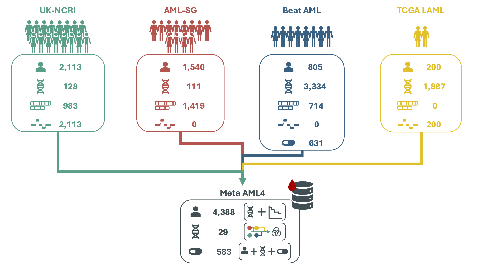

# Meta AML Explorer (deploy bundle)

## Run the app

- **RStudio:** Open `app.R` and click **Run App**.
- **Terminal:** From this directory run `Rscript -e 'shiny::runApp(".", launch.browser = TRUE)'`.

Requires `AML_Meta_Cohort_v2.rds` (or `AML_Meta_Cohort.rds` / `AML_Meta_Cohort.RData`) and `beataml2_data/` with `mutations.txt` and `inhibitor_auc.txt`.

## Deploy (Shinyapps.io)

Use the **rsconnect** configuration in this folder. The app reads only: `app.R`, `load_beataml2.R`, the cohort RDS, `beataml2_data/`, and `www/`.
