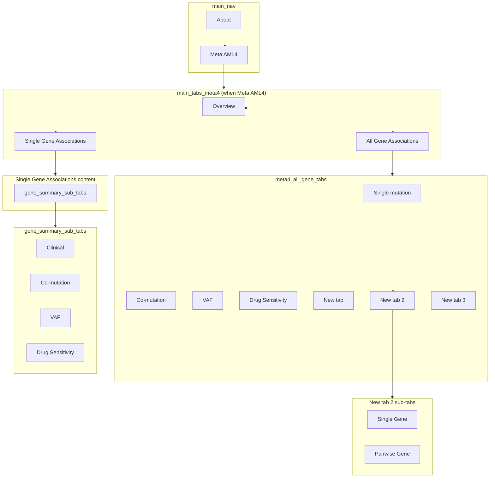

# Meta AML Explorer — Tab nesting structure

Current tab hierarchy as implemented in `app.R`.  
`tabsetPanel` = row of tab labels; `tabPanel` = one tab (label + content).

---

## 1. Top-level UI (static)

```
fluidPage
└── tabsetPanel (id = "main_nav")
    ├── tabPanel("About", value = "about")
    │   └── [welcome content]
    └── tabPanel("Meta AML4", value = "meta_aml4")
        └── conditionalPanel → sidebarLayout
            ├── sidebarPanel [filters + gene_summary select]
            └── mainPanel
                ├── uiOutput("meta4_fallback_banner")
                └── uiOutput("main_tabs_ui")   ← content below is rendered here
```

*(Benard et al. (2021) tab is commented out.)*

---

## 2. When "Meta AML4" is selected — `main_tabs_ui` renders:

```
tabsetPanel (id = "main_tabs_meta4")
├── tabPanel("Overview")
│   └── [summary table, cohort plot]
│
├── tabPanel("All Gene Associations")
│   └── tabsetPanel (id = "meta4_all_gene_tabs", type = "tabs")
│       ├── tabPanel("Single mutation", value = "Single")
│       │   └── [clinical, forest, KM, survival table]
│       ├── tabPanel("Co-mutation", value = "Co-mutation")
│       │   └── (placeholder / empty)
│       ├── tabPanel("VAF", value = "VAF")
│       │   └── (placeholder / empty)
│       ├── tabPanel("Drug Sensitivity", value = "Drug Sensitivity")
│       │   └── [drug_summary_ui, LOOCV heatmap]
│       ├── tabPanel("New tab", value = "New tab")
│       │   └── [oncoprint, co-mutation heatmap/table, gene selection, KM by co-mutation]
│       ├── tabPanel("New tab 2", value = "New tab 2")
│       │   └── tabsetPanel
│       │       ├── tabPanel("Single Gene")
│       │       │   └── [VAF by gene, VAF survival, VAF by category/cohort]
│       │       └── tabPanel("Pairwise Gene")
│       │           └── [VAF scatter]
│       └── tabPanel("New tab 3", value = "New tab 3")
│           └── [BeatAML2 intro, drug_subset, Mut vs WT heatmap, VAF vs AUC dotplot,
│                Individual mutation/VAF panel + LOOCV, Mut vs WT table, VAF vs AUC table]
│
└── tabPanel("Single Gene Associations")
    └── uiOutput("gene_summary_ui")   ← see section 4
```

---

## 3. When "Benard et al. (2021)" is selected (commented out; structure still in code)

If `main_nav === "analyses"`, `main_tabs_ui` would render:

```
tabsetPanel (id = "main_tabs_analyses")
├── tabPanel("Overview")
│   └── [summary table, cohort plot, oncoprint]
├── tabPanel("Single mutation associations")
│   └── [clinical, forest, KM, survival table]
├── tabPanel("Co-mutation Associations")
│   └── [oncoprint, co-mutation heatmap/table, gene selection, KM by co-mutation]
├── tabPanel("VAF Associations")
│   └── tabsetPanel
│       ├── tabPanel("Single Gene")
│       │   └── [VAF by gene, VAF survival, VAF by category/cohort]
│       └── tabPanel("Pairwise Gene")
│           └── [VAF scatter]
└── tabPanel("Drug Sensitivity")
    └── [BeatAML2 intro, drug_subset, Mut vs WT, VAF vs AUC, individual panels, tables]
```

---

## 4. Single Gene Associations content — `gene_summary_ui`

When a gene is selected in the sidebar, this is the nested structure inside the **Single Gene Associations** tab:

```
[gene header + NCBI/CIViC summaries]
tabsetPanel (id = "gene_summary_sub_tabs")
├── tabPanel("Clinical", value = "clinical")
│   └── [clinical associations, lollipop, KM]
├── tabPanel("Co-mutation", value = "comut")
│   └── [oncoprint, odds-ratio heatmap, pairwise/triple co-mut survival]
├── tabPanel("VAF", value = "vaf")
│   └── [VAF distribution, VAF–survival MaxStat]
└── tabPanel("Drug Sensitivity", value = "drug")
    └── [Mut vs WT volcano, VAF–AUC dotplot, tables]
```

---

## 5. Summary diagram (Mermaid)



---

## 6. IDs and values (for Shiny / JS)

| Level              | id / value              | Notes                          |
|--------------------|-------------------------|--------------------------------|
| Main nav           | `main_nav`              | "about", "meta_aml4"           |
| Meta AML4 tabs     | `main_tabs_meta4`       | Overview, All Gene, Single Gene |
| All Gene sub-tabs  | `meta4_all_gene_tabs`   | Single, Co-mutation, VAF, Drug Sensitivity, New tab, New tab 2, New tab 3 |
| Single Gene sub-tabs | `gene_summary_sub_tabs` | clinical, comut, vaf, drug    |

Inner tab values (e.g. `value = "Single"`) are used for `selected_meta4_allgene_tab()` so the selected sub-tab is preserved when filters change.
